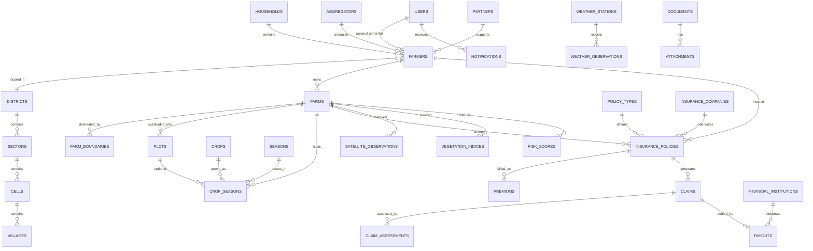

# AegisTerra Entity-Relationship Overview (Phase 3)

**Companion to:** `DataArchitecture.md`  
**Notation:** Crow’s foot text + Mermaid. Cardinalities are logical; physical FKs are UUID.

---

## 1. Context map

```text
[Identity]──user_id?──►[Agriculture: Farmer]
[Geography]◄──district/sector/cell/village_id──[Agriculture]
[Agriculture: Farm]◄──farm_id──[Insurance: Policy]
[Insurance: Claim]──►[Insurance: Payout]
[Climate & Risk]──farm_id?──►[Agriculture: Farm]
[Engagement]──owner──►(polymorphic domain rows)
```

---

## 2. Mermaid ERD (core)



---

## 3. Relationship dictionary

| From | To | Type | Notes |
|------|----|------|-------|
| Household | Farmer | 1:N | Optional household grouping |
| Farmer | Farm | 1:N | Ownership |
| Farm | FarmBoundary | 1:N | Active boundary preferred unique in app |
| Farm | Plot | 1:N | Optional subdivision |
| Crop + Season + Farm | CropSeason | N:M via entity | Unique (crop, season, farm, plot?) |
| PolicyType | InsurancePolicy | 1:N | Product |
| Farmer + Farm | InsurancePolicy | N:1 each | Both required |
| InsurancePolicy | Premium | 1:N | Billing schedule |
| InsurancePolicy | Claim | 1:N | |
| Claim | ClaimAssessment | 1:N | |
| Claim | Payout | 1:0..1 | One primary payout typical |
| District→Village | hierarchy | 1:N chain | |
| WeatherStation | WeatherObservation | 1:N | |
| Farm | SatelliteObservation / VegetationIndex / RiskScore | 1:N | Optional regional rows without farm |

---

## 4. Identity (Phase 2) touchpoints

IAM tables remain as delivered in Phase 2. Phase 3 adds optional `farmers.user_id` → `users.id` (nullable).

Do **not** duplicate person names between `users` and `farmers` as competing sources of truth: Farmer is the agri party record; User is login identity.

---

## 5. History tables

| Live table | History table |
|------------|---------------|
| `insurance_policies` | `insurance_policies_history` |
| `claims` | `claims_history` |
| `payouts` | `payouts_history` |

History rows copy business columns + `history_id`, `original_id`, `changed_at`, `changed_by`, `change_reason`.

---

## 6. Review checklist

- [ ] No circular mandatory FKs
- [ ] Soft-delete uniques are partial indexes
- [ ] Spatial entities have GIST indexes
- [ ] Insurance amounts use `NUMERIC(19,4)` (or equivalent), not float
